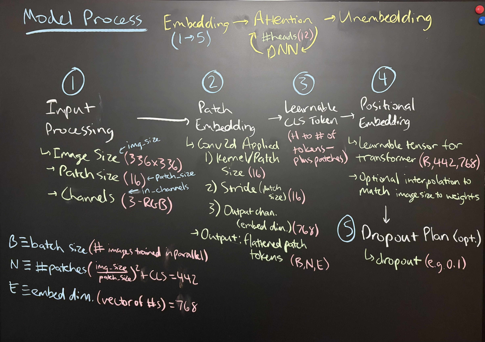
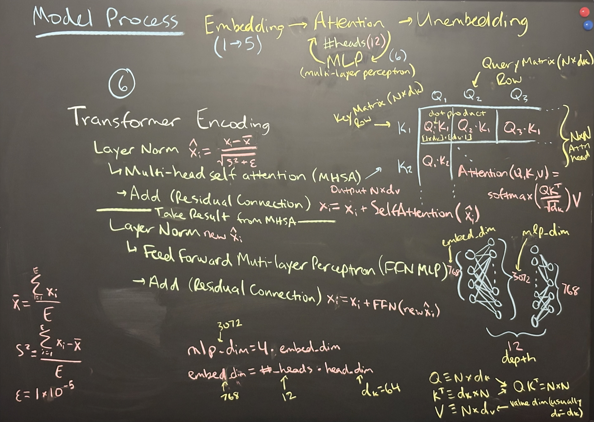

# Vision Transformer (ViT) in PyTorch

This project contains a clean, modular implementation of a Vision Transformer for image classification (e.g., CIFAR-10).

## 📁 Project Structure
```
vision_transformer_project/
├── vit_example.py        # Main script for training/evaluation
├── config.py             # Configuration dictionary
├── requirements.txt      # Project dependencies
├── README.md             # Project overview and instructions
├── models/vit.py         # ViT model definition
├── data/dataset.py       # Data loading and transforms
├── train/trainer.py      # Training loop logic
├── train/evaluate.py     # Evaluation logic
├── utils/helpers.py      # Utilities (checkpointing, etc.)
├── utils/visualize.py    # Attention map visualization
└── checkpoints/          # Saved model weights
```

## 🚀 Getting Started

### 1. Install Dependencies
```bash
pip install -r requirements.txt
```

### 2. Train the Model
```bash
python vit_example.py --mode train --epochs 20 --lr 1e-4
```

### 3. Evaluate the Model
```bash
python vit_example.py --mode eval --checkpoint checkpoints/vit_epoch10.pt
```

### 4. Visualize Attention
```python
from models.vit import VisionTransformer
from utils.visualize import visualize_attention
import torch

# Load model and image
model = VisionTransformer(**cfg['model_params']).to(cfg['device'])
model.load_state_dict(torch.load('checkpoints/vit_epoch10.pt', map_location=cfg['device']))
# Assume `image_tensor` is a torch.Tensor of shape [3, H, W]
visualize_attention(model, image_tensor)
```

## Theory

Below is the high-level theory behind our Vision Transformer:

1. **Patch Embedding**  
   Each input image is split into patches and linearly projected into embeddings…
   
2. **Self-Attention & Transformer Blocks**  
   The embeddings are processed via multi-head self-attention, followed by MLP layers…

---  
### Figures

<p align="center">
  <br/>
  <em>Figure 1: How image patches are embedded into tokens.</em>
</p>

<p align="center">
  <br/>
  <em>Figure 2: Overview of the Transformer block operations.</em>
</p>


## 📚 Features
- From-scratch ViT implementation
- Configurable via `config.py`
- CLI with `argparse`
- Checkpointing and logging utilities
- Attention visualization
- MPS/GPU/CPU support

## 🛠️ To Do
- Add custom dataset support
- Data augmentation pipelines
- Pretrained weights loading
- Experiment logging (TensorBoard, W&B)